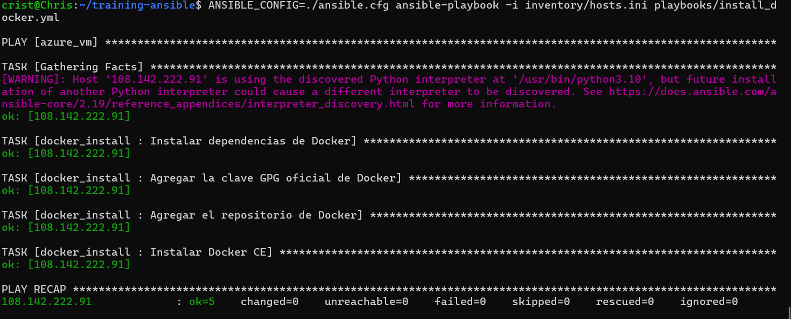
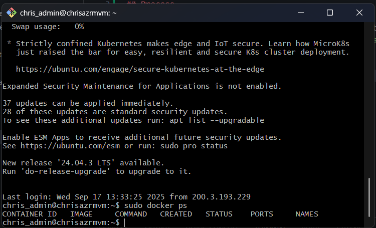
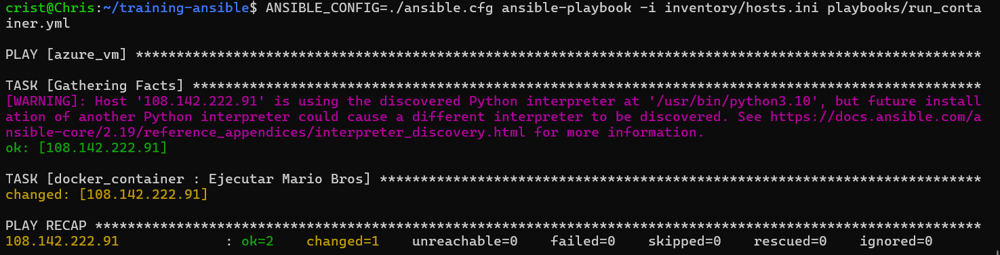

# training-ansible

## Process

I installed ansible using the WSL with a Ubuntu distro. Windows had a problem locating the ansible.cfg, so I had to modify the command to include it `ANSIBLE_CONFIG=./ansible.cfg ansible-playbook -i inventory/hosts.ini playbooks/install_docker.yml`. I modified the code for the infrastructure to accept password login and expose the 8787 port. Also, I put the credentials in the hosts.ini.

After doing it, the VM has docker installed

Now, I execute the task run container:

After that, I get the service running and consuming 5 dollars/day

